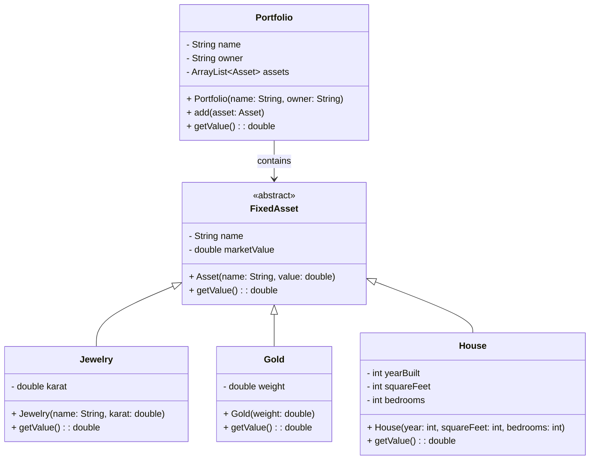

```mermaid
classDiagram
    class Portfolio {
        - String name
        - String owner
        - ArrayList~Asset~ assets
        + Portfolio(name: String, owner: String)
        + add(asset: Asset)
        + getValue(): double
    }

    class FixedAsset {
        <<abstract>>
        - String name
        - double marketValue
        + Asset(name: String, value: double)
        + getValue(): double
    }

    class Jewelry {
        - double karat
        + Jewelry(name: String, karat: double)
        + getValue(): double
    }

    class Gold {
        - double weight
        + Gold(weight: double)
        + getValue(): double
    }

    class House {
        - int yearBuilt
        - int squareFeet
        - int bedrooms
        + House(year: int, squareFeet: int, bedrooms: int)
        + getValue(): double
    }

    Portfolio --> FixedAsset : contains
    FixedAsset <|-- Jewelry
    FixedAsset <|-- Gold
    FixedAsset <|-- House
```