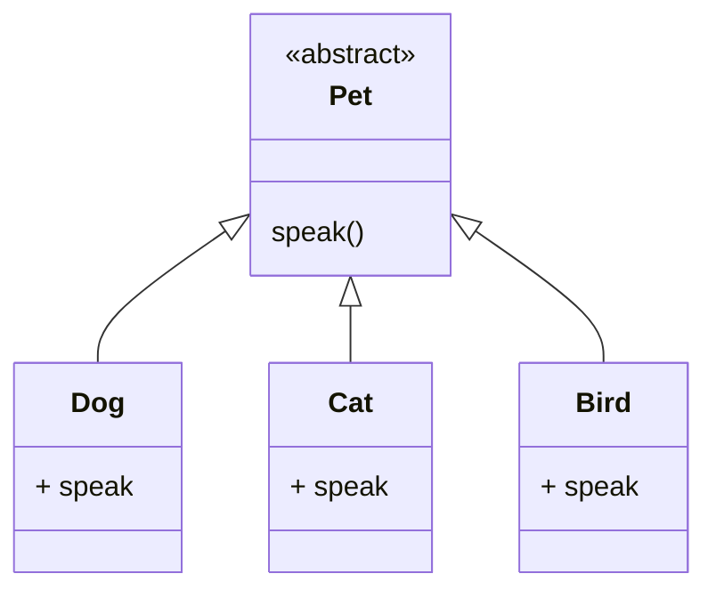

```mermaid
classDiagram
    class Pet {
    <<abstract>>
    speak()
    }
class Dog {
    + speak
    }
class Cat {
    + speak
    }
class Bird {
    + speak
    }

Pet <|-- Dog
Pet <|-- Cat
Pet <|-- Bird

```
